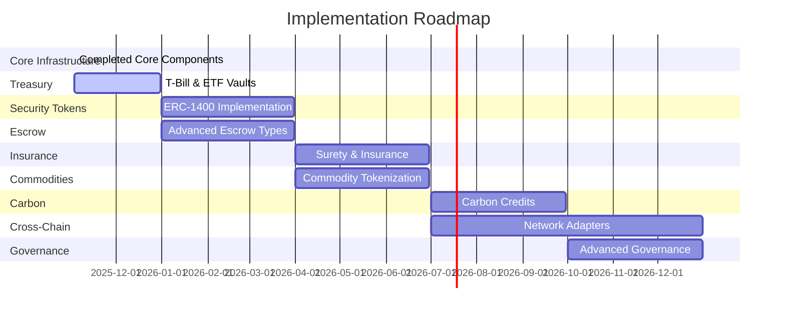

# Project Roadmap & Implementation Status

## Current Implementation Status 🚀

### Core Infrastructure (Completed ✅)

| Component | Status | Description |
|-----------|--------|-------------|
| `StableUSD.sol` | ✅ | Primary stablecoin implementation |
| `ComplianceRegistryUpgradeable.sol` | ✅ | KYC and compliance management |
| `PolicyEngineUpgradeable.sol` | ✅ | Policy enforcement engine |
| `ReserveManager.sol` | ✅ | Reserve asset management |
| `BaselCARModule.sol` | ✅ | Capital adequacy monitoring |
| `SettlementHub2PC.sol` | ✅ | Two-phase commit settlement |

### Stablecoin Stack (Completed ✅)

| Component | Status | Description |
|-----------|--------|-------------|
| `CompliantStable.sol` | ✅ | Asset-backed stablecoin with NAV rebase |
| `StablecoinPolicyEngine.sol` | ✅ | Policy engine for stablecoin operations |
| `NAVRebaseController.sol` | ✅ | Controls NAV-based rebase operations |
| `FeeRouter.sol` | ✅ | Fee distribution and routing |

## Planned Implementations 🔄

### Treasury & Asset Vaults (Q4 2025)

| Component | Status | Priority |
|-----------|--------|----------|
| `TBillVault.sol` | 🔄 | High |
| `ETFWrapper.sol` | 🔄 | High |
| `MMFVault.sol` | 🔄 | Medium |
| `AssetBasket.sol` | 🔄 | Medium |

### Security Token Infrastructure (Q1 2026)

| Component | Status | Priority |
|-----------|--------|----------|
| `ERC1400Core.sol` | 🔄 | High |
| `SecurityTokenController.sol` | 🔄 | High |
| `DocumentRegistry.sol` | 🔄 | Medium |
| `TransferManager.sol` | 🔄 | Medium |

### Advanced Escrow (Q1 2026)

| Component | Status | Priority |
|-----------|--------|----------|
| `PvPEscrow.sol` | 🔄 | High |
| `LienManager.sol` | 🔄 | Medium |
| `AtomicSwapEscrow.sol` | 🔄 | Medium |
| `ConditionalEscrow.sol` | 🔄 | Low |

### Insurance & Surety (Q2 2026)

| Component | Status | Priority |
|-----------|--------|----------|
| `SBLCInstrument.sol` | 🔄 | High |
| `InsurancePool.sol` | 🔄 | Medium |
| `SuretyBondManager.sol` | 🔄 | Medium |
| `ClaimProcessor.sol` | 🔄 | Low |

### Commodity Tokenization (Q2 2026)

| Component | Status | Priority |
|-----------|--------|----------|
| `XAUVault.sol` | 🔄 | High |
| `CommodityBasket.sol` | 🔄 | High |
| `WaterRightsToken.sol` | 🔄 | Medium |
| `RealEstateToken.sol` | 🔄 | Medium |

### Carbon Credits (Q3 2026)

| Component | Status | Priority |
|-----------|--------|----------|
| `CarbonCreditToken.sol` | 🔄 | High |
| `EmissionRegistry.sol` | 🔄 | High |
| `OffsetValidator.sol` | 🔄 | Medium |
| `ProjectRegistry.sol` | 🔄 | Medium |

### Cross-Chain Infrastructure (Q3-Q4 2026)

| Component | Status | Priority |
|-----------|--------|----------|
| `LayerZeroAdapter.sol` | 🔄 | High |
| `RLNAdapter.sol` | 🔄 | High |
| `FnalityBridge.sol` | 🔄 | High |
| `CrossChainController.sol` | 🔄 | Medium |

### Advanced Governance (Q4 2026)

| Component | Status | Priority |
|-----------|--------|----------|
| `OracleHub.sol` | 🔄 | High |
| `AccessManager.sol` | 🔄 | High |
| `GovernanceController.sol` | 🔄 | Medium |
| `ProposalExecutor.sol` | 🔄 | Medium |

## Implementation Timeline 📅

## Implementation Priorities

### High Priority (Q4 2025)
1. Treasury vaults for T-Bills and ETFs
2. Core ERC-1400 security token infrastructure
3. PvP escrow implementation
4. Initial cross-chain adapters

### Medium Priority (Q1-Q2 2026)
1. Insurance and surety instruments
2. Commodity tokenization infrastructure
3. Advanced escrow types
4. Document and transfer management

### Long-term Development (Q3-Q4 2026)
1. Carbon credit infrastructure
2. Advanced governance systems
3. Extended cross-chain support
4. Additional asset tokenization

## Technical Debt & Maintenance

### Current Focus
- Unit test coverage expansion
- Gas optimization for core contracts
- Documentation improvements
- Security audits for new components

### Ongoing Tasks
- Regular security reviews
- Performance optimization
- Cross-chain testing
- Documentation updates

## Integration Requirements

### External Systems
- Banking infrastructure
- Asset custody solutions
- Regulatory reporting
- Market data feeds

### Blockchain Networks
- Ethereum mainnet
- Layer 2 solutions
- Alternative L1s
- Private networks

## Risk Management

### Technical Risks
- Smart contract vulnerabilities
- Cross-chain bridge security
- Oracle manipulation
- Gas optimization

### Operational Risks
- Regulatory compliance
- Asset custody
- Market volatility
- Network congestion

## Success Metrics

### Technical Metrics
- Test coverage > 95%
- Gas optimization targets met
- Security audit clearance
- Performance benchmarks

### Business Metrics
- Transaction volume
- Asset tokenization value
- Cross-chain adoption
- Market integration