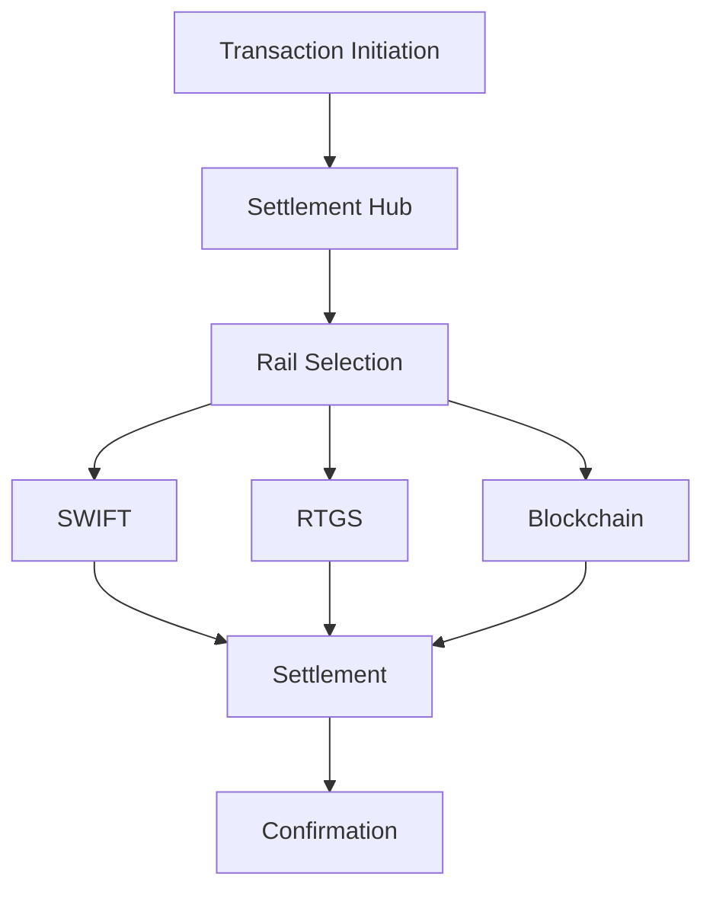
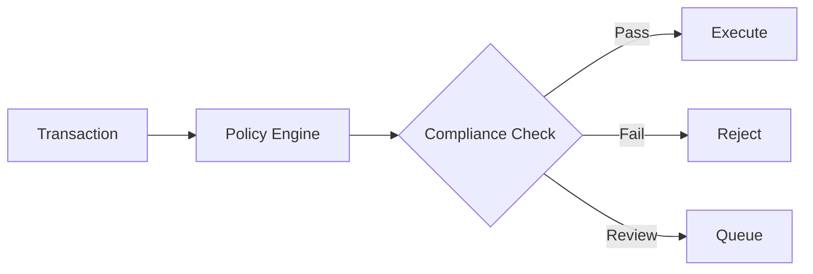
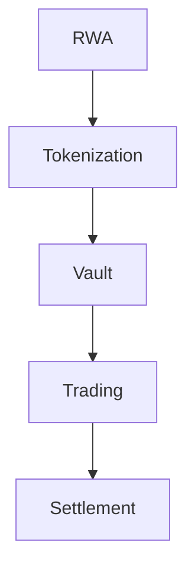
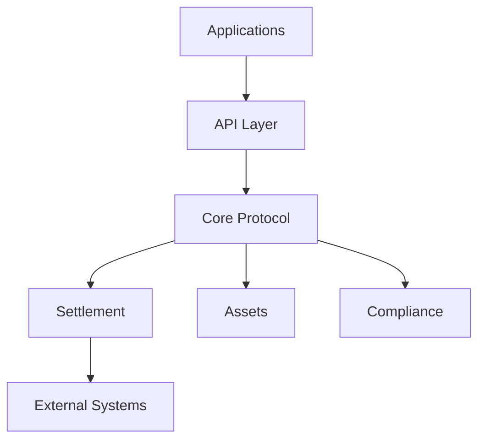
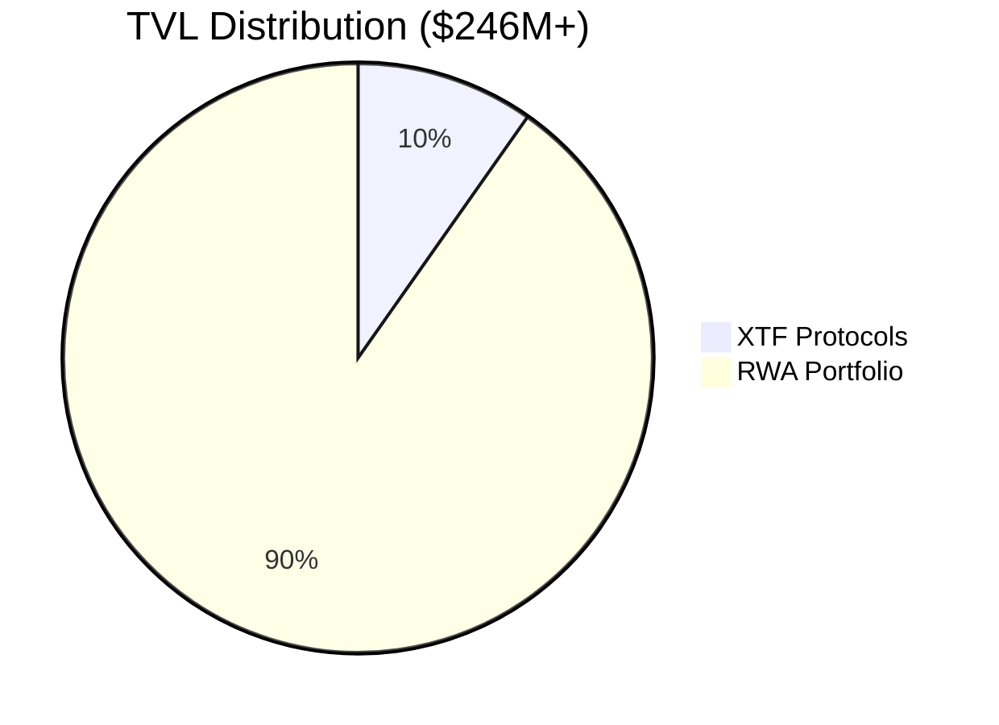
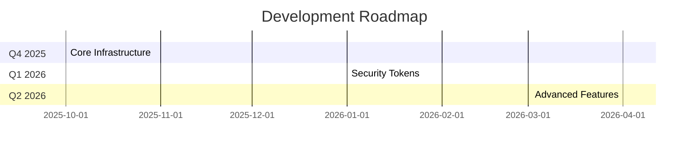

# Unykorn Layer 1: Institutional-Grade Blockchain Infrastructure

## System Overview & Technical Presentation

### Table of Contents

1. [Infrastructure Overview](#infrastructure-overview)
2. [Key Components](#key-components)
3. [Technical Architecture](#technical-architecture)
4. [System Integration](#system-integration)
5. [Performance & Security](#performance--security)
6. [Business Impact](#business-impact)

---

## Infrastructure Overview

### Core Statistics

- 🔗 Chain ID: 7777
- 📝 Smart Contracts: 170+
- 💰 TVL: $246M+
- 🏢 RWA Portfolio: $222M+
- 🖥️ Validators: 21 (expandable to 100)
- ⚡ TPS: 500-1,000 (peak 5,000+)

### Key Features

1. Multi-Rail Settlement
   - SWIFT GPI Integration
   - BIS Project Agorá
   - RLN Multi-CBDC Network
   - Fnality Wholesale Settlement

2. Asset Tokenization
   - Real World Assets (RWA)
   - Security Tokens
   - Stablecoins
   - Carbon Credits

3. Regulatory Compliance
   - FATF Travel Rule
   - Basel III/IV
   - MiCA Framework
   - SEC/DFSA/MAS Standards

---

## Key Components

### 1. Settlement Infrastructure

### 2. Compliance Framework

### 3. RWA Integration

---

## Technical Architecture

### Core Layer 1 Features

1. **Consensus**
   - IBFT/QBFT
   - 2-second finality
   - Quantum resistance

2. **Security**
   - AI-enhanced monitoring
   - Multi-sig governance
   - Circuit breakers

3. **Scalability**
   - Parallel processing
   - Optimized execution
   - Cross-chain bridges

### System Components

---

## System Integration

### Cross-Chain Bridges

| Bridge | TVL | Status |
|--------|-----|--------|
| XRPL | $726K | Live |
| Cosmos IBC | - | Ready |
| CCIP | - | Ready |
| Wormhole | - | Ready |

### External Systems

1. **Banking Integration**
   - SWIFT Network
   - Central Banks
   - Commercial Banks

2. **Market Infrastructure**
   - Exchanges
   - Clearing Houses
   - Custodians

3. **Regulatory Systems**
   - Reporting Hubs
   - Compliance Systems
   - Monitoring Tools

---

## Performance & Security

### Performance Metrics

| Metric | Value | Notes |
|--------|-------|-------|
| TPS | 500-1,000 | Peak 5,000+ |
| Finality | 2s | IBFT/QBFT |
| Latency | <100ms | Network-dependent |
| Throughput | 50M/day | Theoretical max |

### Security Features

1. **Cryptographic Security**
   - Quantum-resistant algorithms
   - Multi-signature schemes
   - Zero-knowledge proofs

2. **Operational Security**
   - AI monitoring
   - Circuit breakers
   - Role-based access

3. **Compliance Security**
   - KYC/AML checks
   - Travel rule enforcement
   - Sanctions screening

---

## Business Impact

### Financial Metrics

### Market Reach

| Region | Status | Partners |
|--------|--------|----------|
| APAC | Live | 12 |
| EMEA | Live | 15 |
| Americas | Live | 8 |

### Growth Trajectory

---

## Implementation Status

### Deployed Systems

✅ Core Infrastructure
- Base protocol
- Settlement system
- Compliance engine

🔄 In Progress
- Treasury vaults
- Security tokens
- Advanced governance

📅 Planned
- Real estate system
- Water rights
- AI governance

### Next Steps

1. Complete Q4 2025 milestones
2. Launch security token infrastructure
3. Expand RWA portfolio
4. Enhance cross-chain capabilities

---

## Contact & Resources

### Documentation
- [Technical Docs](docs/)
- [API Reference](docs/api/)
- [Integration Guide](docs/integration/)

### Support
- Technical Support: tech@unykorn.io
- Business Inquiries: business@unykorn.io
- Partnership: partners@unykorn.io