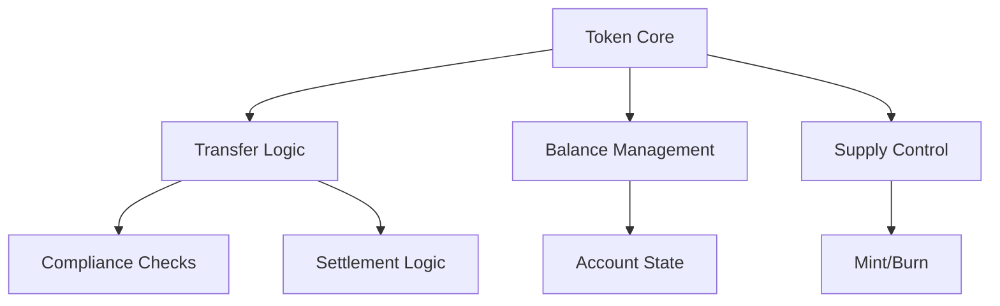
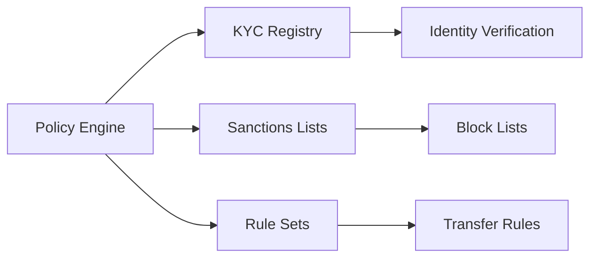
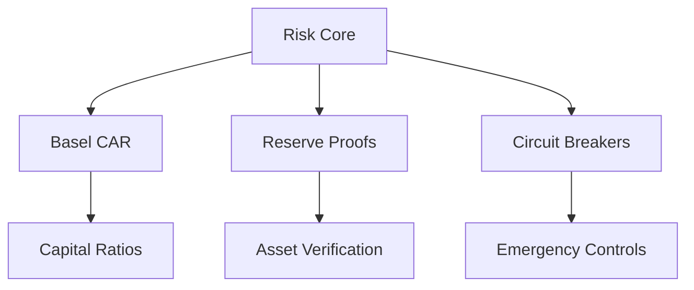
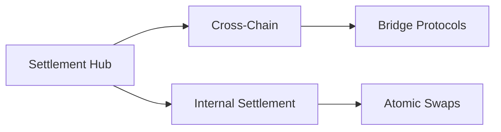
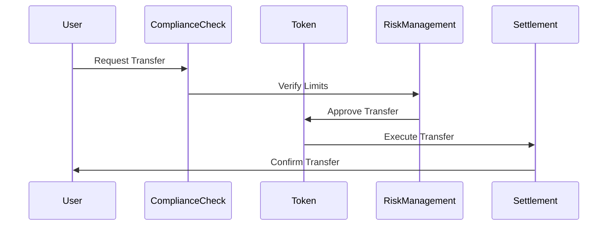
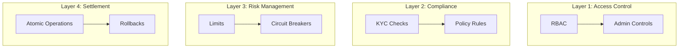
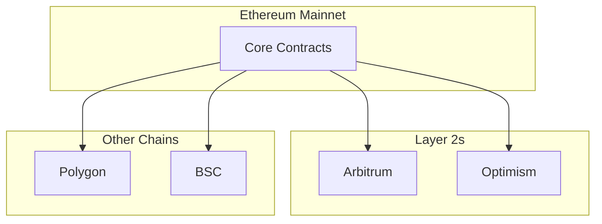
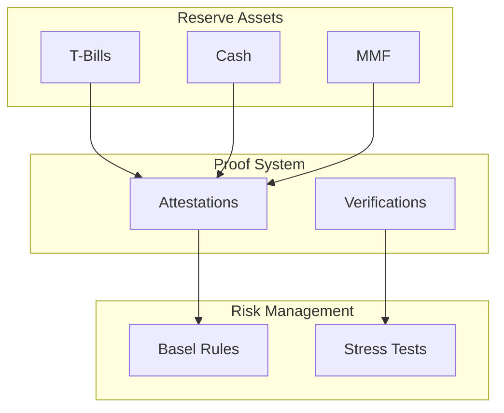

# System Architecture

## Overview

The Global Swift Stablecoins & CBDC infrastructure is built on a modular architecture that emphasizes security, compliance, and interoperability.

## Core Components

### 1. Token Layer

#### Key Components:
- StableUSD.sol
- RWASecurityToken.sol
- RebasedBillToken.sol

### 2. Compliance Layer

#### Key Components:
- ComplianceRegistryUpgradeable.sol
- PolicyEngineUpgradeable.sol
- SanctionsOracle.sol

### 3. Risk Management Layer

#### Key Components:
- BaselCARModule.sol
- ReserveManager.sol
- PolicyCircuitBreaker.sol

### 4. Settlement Layer

#### Key Components:
- SettlementHub2PC.sol
- CCIPAttestationSender.sol
- FxPvPRouter.sol

## Interaction Flow

## Security Architecture

### Multi-Layer Security Model

## Network Architecture

## Reserve Infrastructure

## Integration Points

### External Systems
- Banking APIs
- SWIFT Network
- ISO 20022 Messaging
- Regulatory Reporting

### Cross-Chain
- CCIP (Chainlink)
- Wormhole
- LayerZero
- Axelar

### Oracle Networks
- Chainlink
- Pyth
- API3
- UMA