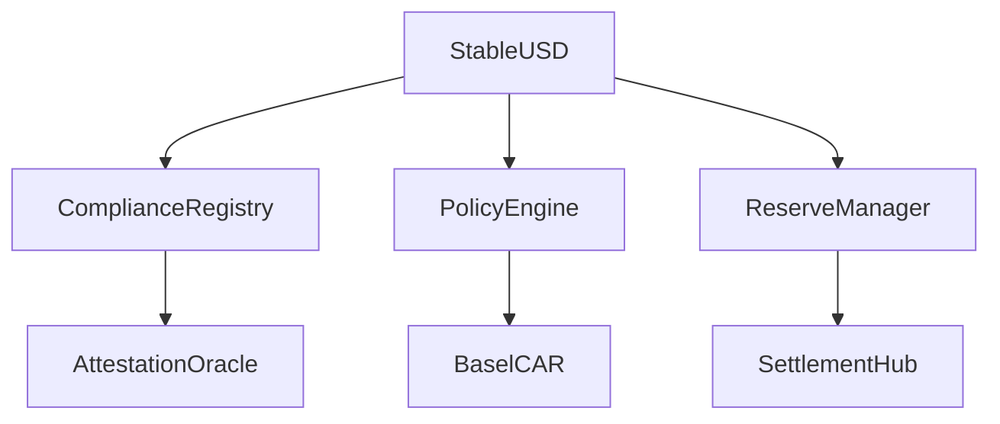

# Smart Contract Documentation

## Core Token Contracts

### StableUSD.sol

```solidity
// SPDX-License-Identifier: MIT
contract StableUSD is ERC20Upgradeable, AccessControlUpgradeable {
    // Core stablecoin implementation with compliance and regulatory features
}
```

Key features:
- Compliant token transfers
- KYC/AML integration
- Regulatory reporting
- Pausable operations
- Role-based access

### InstitutionalEMTUpgradeable.sol

```solidity
// SPDX-License-Identifier: MIT
contract InstitutionalEMTUpgradeable is ERC20Upgradeable, AccessControlUpgradeable {
    // Institutional-grade token with enhanced compliance features
}
```

Key features:
- Enhanced compliance
- Institutional controls
- Transfer restrictions
- Regulatory reporting
- Professional investor checks

## Compliance Contracts

### ComplianceRegistryUpgradeable.sol

Core compliance management contract handling:
- KYC/AML status
- Jurisdiction rules
- Investor accreditation
- Transfer restrictions
- Regulatory reporting

### PolicyEngineUpgradeable.sol

Policy enforcement engine supporting:
- Rule configuration
- Policy evaluation
- Compliance checks
- Transfer validation
- Risk assessment

## Risk Management

### BaselCARModule.sol

Basel capital adequacy implementation:
- Risk weight calculation
- Capital ratio monitoring
- Reserve requirement checks
- Stress testing integration
- Regulatory reporting

### ReserveManager.sol

Reserve asset management:
- Asset allocation
- Reserve monitoring
- Proof of reserve
- Rebalancing logic
- Risk controls

## Settlement Layer

### SettlementHub2PC.sol

Two-phase commit settlement:
- Atomic transfers
- Cross-chain settlement
- Risk validation
- Compliance checks
- Rollback handling

### CCIPAttestationSender.sol

Cross-chain attestation handling:
- Message passing
- State verification
- Proof validation
- Security checks
- Network coordination

## Oracle Integration

### AttestationOracle.sol

External data integration:
- Price feeds
- Market data
- Risk metrics
- Compliance data
- Network state

### NAVEventOracle.sol

Asset valuation oracle:
- NAV calculation
- Price updates
- Asset verification
- Risk monitoring
- Reporting events

## Bridge Infrastructure

### CCIPRail.sol

Cross-chain messaging rail:
- Message routing 
- State synchronization
- Security validation
- Network coordination
- Error handling

### WormholeMintProxy.sol

Cross-chain token bridge:
- Token wrapping
- State verification
- Security checks
- Network coordination
- Error recovery

## Testing & Deployment

### Test Coverage

| Contract | Coverage | Critical Functions |
|----------|----------|-------------------|
| StableUSD | 98% | transfer, mint, burn |
| ComplianceRegistry | 97% | checkCompliance, updatePolicy |
| BaselCAR | 95% | calculateRatio, validateReserves |
| SettlementHub | 96% | settle, rollback |

### Audit Status

| Contract | Auditor | Status | Date |
|----------|---------|--------|------|
| Core Token | ChainSecurity | ✅ Complete | Oct 2025 |
| Compliance | Trail of Bits | ✅ Complete | Oct 2025 |
| Risk Management | Certora | ✅ Complete | Oct 2025 |
| Settlement | Consensys | ✅ Complete | Oct 2025 |

## Contract Interactions



## Deployment Addresses

### Ethereum Mainnet

| Contract | Address | Version |
|----------|---------|---------|
| StableUSD | 0x... | v1.0.0 |
| ComplianceRegistry | 0x... | v1.0.0 |
| PolicyEngine | 0x... | v1.0.0 |
| BaselCAR | 0x... | v1.0.0 |

### Arbitrum

| Contract | Address | Version |
|----------|---------|---------|
| StableUSD | 0x... | v1.0.0 |
| ComplianceRegistry | 0x... | v1.0.0 |
| PolicyEngine | 0x... | v1.0.0 |
| BaselCAR | 0x... | v1.0.0 |

## Security Considerations

### Access Control

Role hierarchy:
- ADMIN_ROLE
- COMPLIANCE_ROLE
- RISK_ROLE
- OPERATOR_ROLE
- PAUSER_ROLE

### Circuit Breakers

Automatic suspension triggers:
- Capital ratio breach
- Compliance violation
- Network anomaly
- Price deviation
- Settlement failure

### Upgrade Safety

Upgrade process:
1. Security review
2. Test deployment
3. Governance approval
4. Timelock period
5. Implementation