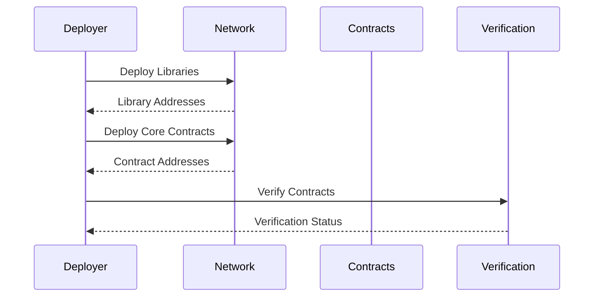

# Deployment Guide

## Prerequisites

1. Environment Setup
   - Node.js v18+
   - Python 3.8+
   - Foundry toolkit
   - Hardhat environment

2. Network Configuration
   - RPC endpoints
   - Network IDs
   - Chain configurations
   - Gas settings

3. Contract Dependencies
   - OpenZeppelin contracts
   - Chainlink interfaces
   - Custom libraries
   - External integrations

## Deployment Process

### 1. Initial Setup

```bash
# Install dependencies
npm install

# Install Foundry components
forge install

# Compile contracts
npm run compile
forge build
```

### 2. Environment Configuration

```bash
# Copy environment template
cp .env.example .env

# Configure variables
PRIVATE_KEY=your_deployer_key
ETHERSCAN_API_KEY=your_api_key
INFURA_API_KEY=your_infura_key
```

### 3. Contract Deployment



### 4. Deployment Scripts

```bash
# Deploy core contracts
npx hardhat run scripts/deploy.js --network mainnet

# Deploy auxiliary contracts
npx hardhat run scripts/deploy-auxiliary.js --network mainnet

# Configure contract parameters
npx hardhat run scripts/configure.js --network mainnet
```

## Network Specific Deployment

### Ethereum Mainnet

```bash
# Deploy mainnet contracts
npm run deploy:mainnet

# Verify on Etherscan
npm run verify:mainnet
```

### Layer 2 Networks

#### Arbitrum

```bash
# Deploy to Arbitrum
npm run deploy:arbitrum

# Configure L2 specific parameters
npm run configure:arbitrum
```

#### Polygon

```bash
# Deploy to Polygon
npm run deploy:polygon

# Configure L2 specific parameters
npm run configure:polygon
```

## Post-Deployment

### 1. Contract Verification

```bash
# Verify all contracts
npm run verify:all

# Check verification status
npm run verify:check
```

### 2. Configuration

```bash
# Set up roles
npm run configure:roles

# Set up policies
npm run configure:policies

# Initialize protocols
npm run initialize:all
```

### 3. Integration Tests

```bash
# Run integration tests
npm run test:integration

# Verify cross-chain
npm run test:crosschain
```

## Deployment Checklist

### Pre-Deployment
- [ ] Environment setup complete
- [ ] Networks configured
- [ ] Dependencies installed
- [ ] Gas estimation done
- [ ] Contracts audited

### Deployment
- [ ] Libraries deployed
- [ ] Core contracts deployed
- [ ] Auxiliary contracts deployed
- [ ] Contracts verified
- [ ] Initial config set

### Post-Deployment
- [ ] Roles assigned
- [ ] Policies configured
- [ ] Integration tests passed
- [ ] Monitoring setup
- [ ] Documentation updated

## Emergency Procedures

### Contract Pause

```javascript
// Pause contract
await contract.pause();

// Verify pause status
const paused = await contract.paused();
```

### Emergency Shutdown

```javascript
// Trigger emergency shutdown
await contract.emergencyShutdown();

// Verify shutdown status
const shutdown = await contract.isShutdown();
```

## Monitoring Setup

### 1. Health Checks

```javascript
// Monitor contract health
async function checkHealth() {
    const status = await contract.getStatus();
    if (!status.healthy) {
        await notifyAdmin();
    }
}
```

### 2. Alerts Configuration

```javascript
// Configure alerting
const alerts = {
    thresholds: {
        capital: 0.95,
        reserves: 1.0,
        gas: 100
    },
    contacts: [
        "admin@example.com",
        "+1234567890"
    ]
};
```

## Upgrade Procedures

### 1. Prepare Upgrade

```javascript
// Deploy new implementation
const newImpl = await deployNewImplementation();

// Verify new implementation
await verifyImplementation(newImpl);
```

### 2. Execute Upgrade

```javascript
// Queue upgrade
await timelock.queueTransaction(
    proxy.address,
    "upgrade",
    newImpl.address
);

// Execute upgrade after timelock
await timelock.executeTransaction(
    proxy.address,
    "upgrade",
    newImpl.address
);
```

## Documentation Updates

### 1. Contract Addresses

Update `deployed-addresses.json`:
```json
{
    "mainnet": {
        "StableUSD": "0x...",
        "ComplianceRegistry": "0x...",
        "PolicyEngine": "0x..."
    }
}
```

### 2. Configuration Details

Update `network-config.json`:
```json
{
    "mainnet": {
        "rpcUrl": "https://...",
        "chainId": 1,
        "gasPrice": "auto"
    }
}
```

## Support Resources

### Documentation
- [Smart Contract Docs](./contracts.md)
- [Architecture Guide](./architecture.md)
- [Security Guide](./security.md)

### Contact Information
- Technical Support: support@example.com
- Emergency Contact: +1-234-567-890
- Security Team: security@example.com