# System Flow Diagrams

## Token Transfer Flow

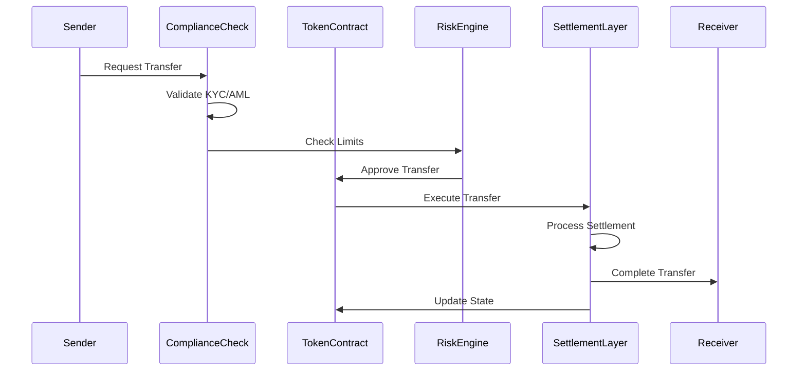

## Cross-Chain Bridge Flow

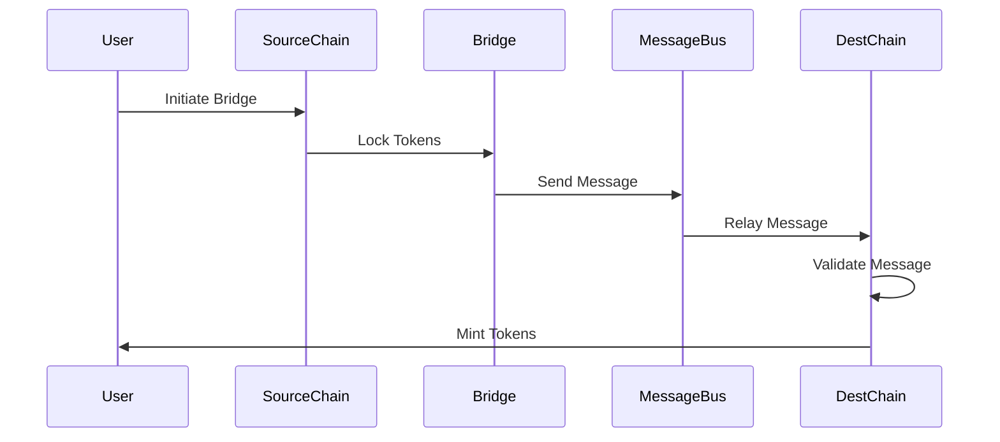

## Compliance Flow

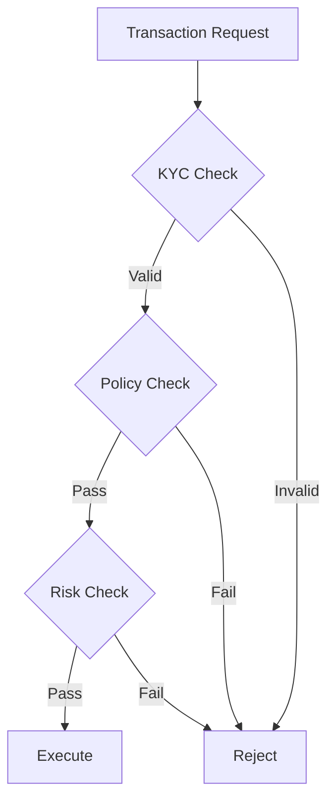

## Settlement Flow

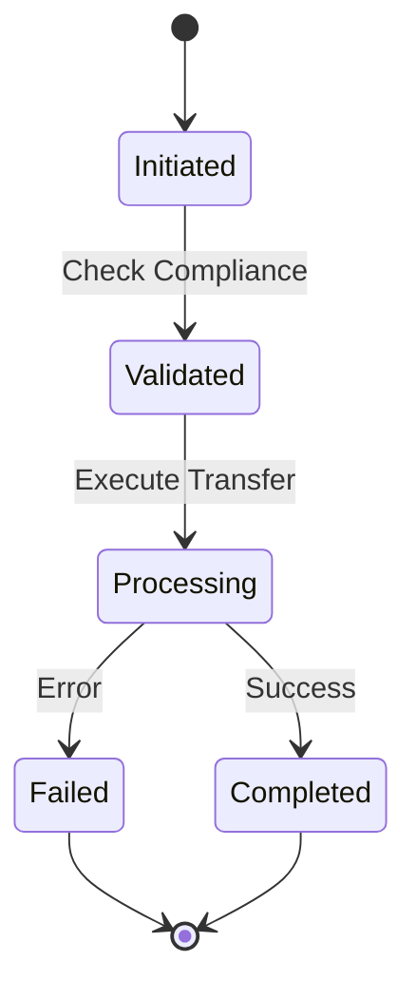

## Reserve Management Flow

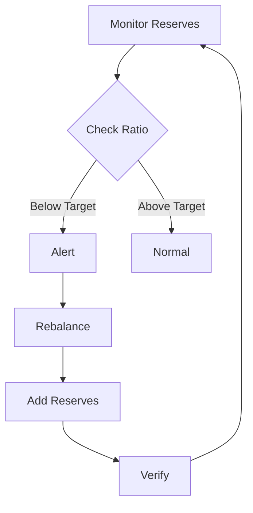

## Risk Management Flow

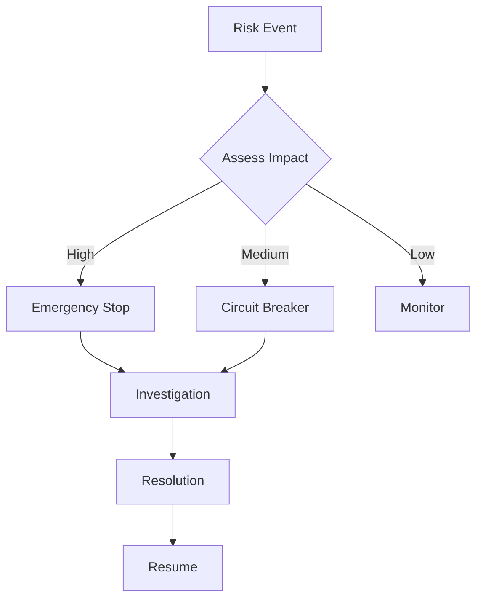

## Upgrade Flow

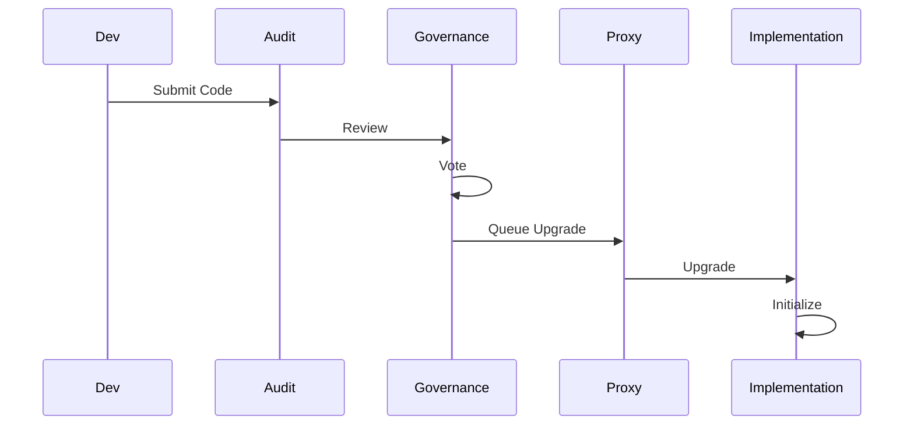

## Emergency Response Flow

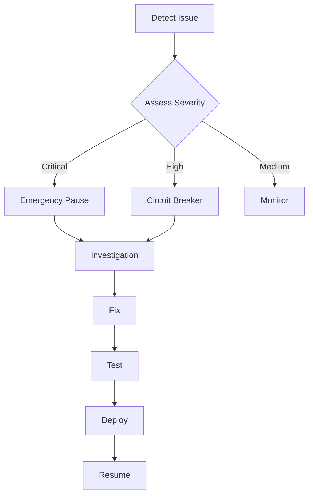

## Oracle Integration Flow

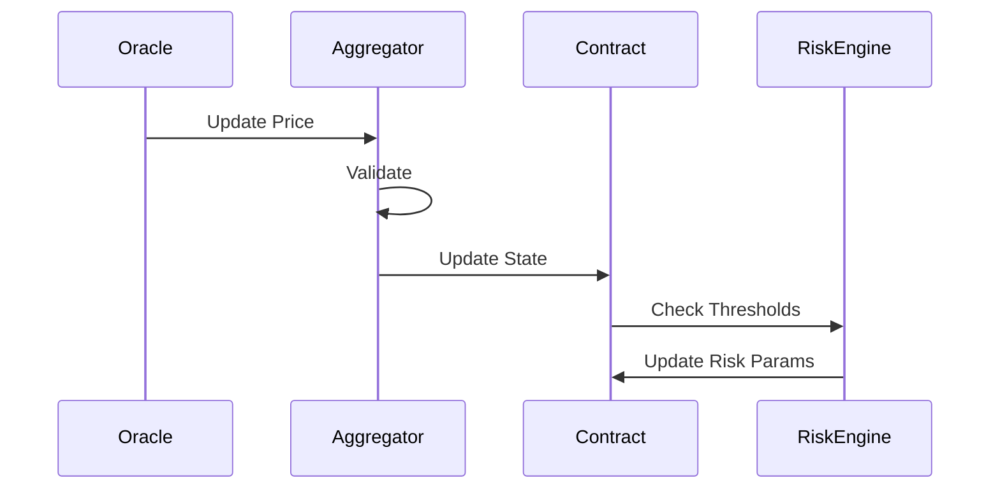

## Capital Management Flow

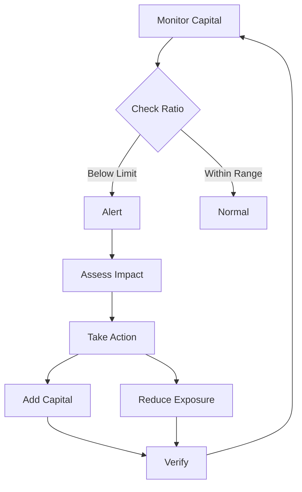

## Network Interaction Flow

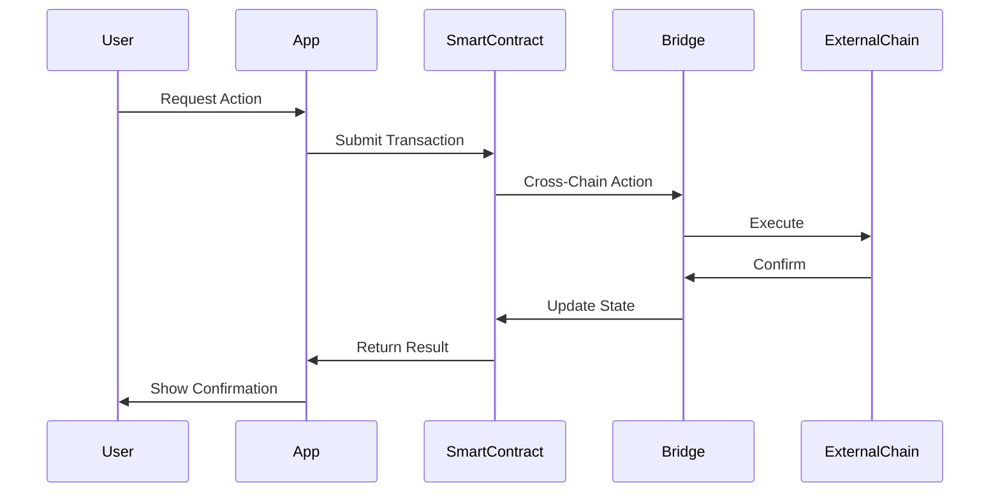