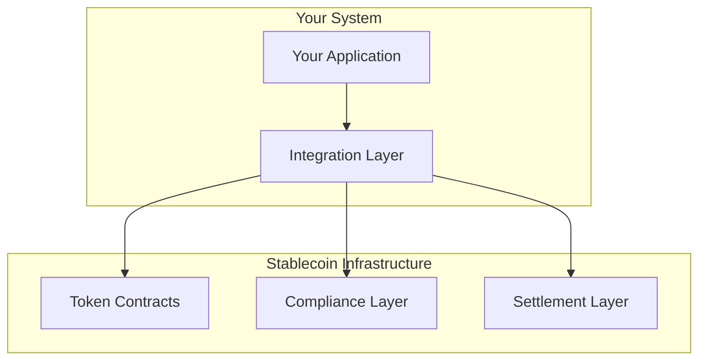

# Integration Guide

## Overview

This guide covers the integration of the Global Swift Stablecoins & CBDC infrastructure into your systems.

## System Architecture



## Integration Points

### 1. Token Integration

```javascript
// Import contracts
const { StableUSD, ComplianceRegistry } = require('@stablecoin/contracts');

// Initialize token contract
const token = await StableUSD.at(TOKEN_ADDRESS);

// Check balance
const balance = await token.balanceOf(address);

// Transfer tokens
await token.transfer(recipient, amount);
```

### 2. Compliance Integration

```javascript
// Initialize compliance
const compliance = await ComplianceRegistry.at(COMPLIANCE_ADDRESS);

// Check compliance status
const status = await compliance.checkCompliance(address);

// Update KYC information
await compliance.updateKYC(address, kycData);
```

### 3. Settlement Integration

```javascript
// Initialize settlement
const settlement = await SettlementHub.at(SETTLEMENT_ADDRESS);

// Create settlement
await settlement.createSettlement({
    asset: assetAddress,
    amount: amount,
    recipient: recipientAddress
});
```

## API Reference

### Token API

#### Balance Operations
```javascript
// Get balance
function getBalance(address) {
    return token.balanceOf(address);
}

// Check allowance
function getAllowance(owner, spender) {
    return token.allowance(owner, spender);
}
```

#### Transfer Operations
```javascript
// Transfer tokens
function transfer(recipient, amount) {
    return token.transfer(recipient, amount);
}

// Transfer from
function transferFrom(sender, recipient, amount) {
    return token.transferFrom(sender, recipient, amount);
}
```

### Compliance API

#### KYC Operations
```javascript
// Check KYC status
function checkKYC(address) {
    return compliance.getKYCStatus(address);
}

// Update KYC data
function updateKYC(address, data) {
    return compliance.updateKYC(address, data);
}
```

#### Policy Operations
```javascript
// Check policy
function checkPolicy(address) {
    return compliance.checkPolicy(address);
}

// Update policy
function updatePolicy(policyId, data) {
    return compliance.updatePolicy(policyId, data);
}
```

### Settlement API

#### Create Settlement
```javascript
// Create new settlement
function createSettlement(params) {
    return settlement.create(params);
}

// Execute settlement
function executeSettlement(settlementId) {
    return settlement.execute(settlementId);
}
```

## Event Handling

### Token Events

```javascript
// Listen for transfers
token.on('Transfer', (from, to, amount) => {
    console.log(`Transfer: ${from} -> ${to}: ${amount}`);
});

// Listen for approvals
token.on('Approval', (owner, spender, amount) => {
    console.log(`Approval: ${owner} -> ${spender}: ${amount}`);
});
```

### Compliance Events

```javascript
// Listen for KYC updates
compliance.on('KYCUpdated', (address, status) => {
    console.log(`KYC Updated: ${address} -> ${status}`);
});

// Listen for policy changes
compliance.on('PolicyUpdated', (policyId, data) => {
    console.log(`Policy Updated: ${policyId}`);
});
```

## Error Handling

### Common Errors

```javascript
try {
    await token.transfer(recipient, amount);
} catch (error) {
    if (error.message.includes('insufficient balance')) {
        // Handle insufficient balance
    } else if (error.message.includes('compliance check failed')) {
        // Handle compliance failure
    }
}
```

### Error Codes

| Code | Description | Resolution |
|------|-------------|------------|
| E001 | Insufficient Balance | Check balance before transfer |
| E002 | Compliance Failed | Verify KYC status |
| E003 | Invalid Settlement | Check settlement parameters |
| E004 | Network Error | Retry operation |

## Security Best Practices

### 1. Access Control

```javascript
// Use proper access control
function adminOperation() {
    require(msg.sender === admin, "Not authorized");
    // Perform operation
}
```

### 2. Input Validation

```javascript
// Validate inputs
function validateTransfer(recipient, amount) {
    require(recipient !== address(0), "Invalid recipient");
    require(amount > 0, "Invalid amount");
}
```

### 3. Error Handling

```javascript
// Proper error handling
function safeOperation() {
    try {
        // Perform operation
    } catch (error) {
        // Log error
        // Notify admin
        // Take corrective action
    }
}
```

## Testing Integration

### Unit Tests

```javascript
describe('Token Integration', () => {
    it('should transfer tokens', async () => {
        const amount = web3.utils.toWei('1');
        await token.transfer(recipient, amount);
        const balance = await token.balanceOf(recipient);
        assert.equal(balance, amount);
    });
});
```

### Integration Tests

```javascript
describe('Full Integration', () => {
    it('should process compliant transfer', async () => {
        // Set up KYC
        await compliance.updateKYC(sender, kycData);
        await compliance.updateKYC(recipient, kycData);
        
        // Perform transfer
        const amount = web3.utils.toWei('1');
        await token.transfer(recipient, amount);
        
        // Verify settlement
        const settlement = await settlement.getSettlement(settlementId);
        assert.equal(settlement.status, 'completed');
    });
});
```

## Sample Integration

### Basic Integration

```javascript
const StablecoinSDK = require('@stablecoin/sdk');

// Initialize SDK
const sdk = new StablecoinSDK({
    rpcUrl: 'https://mainnet.infura.io/v3/your-key',
    privateKey: 'your-private-key'
});

// Use SDK
async function main() {
    // Get token info
    const balance = await sdk.getBalance(address);
    
    // Perform transfer
    const receipt = await sdk.transfer(recipient, amount);
    
    // Check compliance
    const status = await sdk.checkCompliance(address);
}
```

### Advanced Integration

```javascript
// Custom integration class
class StablecoinIntegration {
    constructor(config) {
        this.sdk = new StablecoinSDK(config);
        this.setupEventHandlers();
    }
    
    setupEventHandlers() {
        this.sdk.on('Transfer', this.handleTransfer);
        this.sdk.on('Compliance', this.handleCompliance);
    }
    
    async processTransfer(params) {
        // Validate inputs
        this.validateParams(params);
        
        // Check compliance
        await this.checkCompliance(params);
        
        // Execute transfer
        return this.sdk.transfer(params);
    }
}
```

## Monitoring & Maintenance

### Health Checks

```javascript
async function performHealthCheck() {
    // Check token contract
    const tokenHealth = await token.healthCheck();
    
    // Check compliance
    const complianceHealth = await compliance.healthCheck();
    
    // Check settlement
    const settlementHealth = await settlement.healthCheck();
    
    return {
        token: tokenHealth,
        compliance: complianceHealth,
        settlement: settlementHealth
    };
}
```

### Monitoring

```javascript
// Set up monitoring
const monitor = new Monitor({
    contracts: [token, compliance, settlement],
    alertThreshold: {
        errors: 3,
        timeWindow: 300 // 5 minutes
    }
});

// Start monitoring
monitor.start();
```

## Support

### Documentation
- [API Reference](./api.md)
- [Error Codes](./errors.md)
- [FAQ](./faq.md)

### Contact
- Technical Support: integration-support@example.com
- Emergency Support: +1-234-567-890

## Appendix

### Configuration Template
```json
{
    "network": "mainnet",
    "contracts": {
        "token": "0x...",
        "compliance": "0x...",
        "settlement": "0x..."
    },
    "api": {
        "url": "https://api.example.com",
        "key": "your-api-key"
    }
}
```

### Common Workflows

1. User Onboarding
   - Collect KYC information
   - Update compliance registry
   - Verify status
   - Enable transfers

2. Transfer Processing
   - Check balances
   - Verify compliance
   - Execute transfer
   - Monitor settlement

3. Compliance Updates
   - Update KYC data
   - Modify policies
   - Verify changes
   - Monitor events