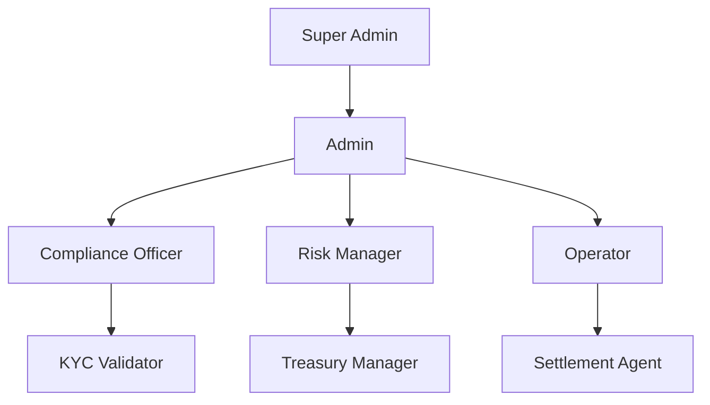
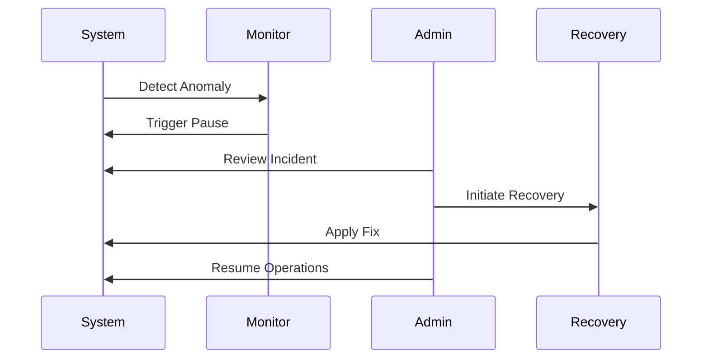
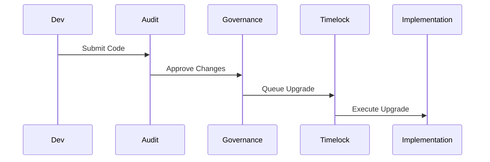
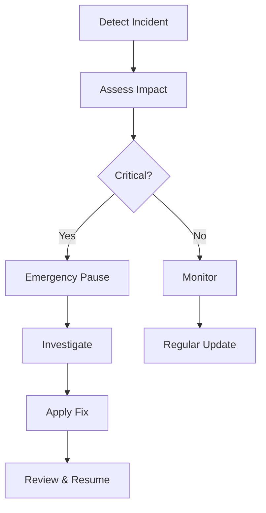

# Security Architecture & Features

## Security Model

### Multi-Layer Security Architecture

```mermaid
graph TB
    subgraph "Layer 1 - Access Control"
        A[Role-Based Access] --> B[Admin Controls]
        B --> C[Emergency Functions]
    end
    
    subgraph "Layer 2 - Compliance"
        D[KYC Validation] --> E[Transfer Rules]
        E --> F[Policy Engine]
    end
    
    subgraph "Layer 3 - Risk Management"
        G[Capital Controls] --> H[Circuit Breakers]
        H --> I[Reserve Validation]
    end
    
    subgraph "Layer 4 - Settlement"
        J[Atomic Operations] --> K[Rollback System]
        K --> L[State Verification]
    end
```

## Access Control System

### Role Hierarchy

### Permission Matrix

| Role | Mint/Burn | Policy Updates | KYC | Settlement | Emergency |
|------|-----------|----------------|-----|------------|-----------|
| Super Admin | ✅ | ✅ | ✅ | ✅ | ✅ |
| Admin | ✅ | ✅ | ✅ | ✅ | ❌ |
| Compliance | ❌ | ✅ | ✅ | ❌ | ❌ |
| Risk Manager | ❌ | ❌ | ❌ | ✅ | ✅ |
| Operator | ❌ | ❌ | ❌ | ✅ | ❌ |

## Circuit Breakers

### Automatic Triggers

1. Capital Adequacy
   - Reserve ratio below threshold
   - Risk-weighted asset limits
   - Exposure concentration

2. Compliance
   - Suspicious transaction patterns
   - Large transfer alerts
   - Geographic restrictions

3. Technical
   - Oracle deviation
   - Network congestion
   - Gas price spikes

### Recovery Procedures

## Audit Trail

### Event Logging

All critical operations emit detailed events:
- Transfer details
- Policy changes
- KYC updates
- Risk parameters
- Circuit breaker triggers

### Transaction Monitoring

Real-time monitoring of:
- Transaction volume
- Transfer patterns
- Risk metrics
- Compliance status
- Network health

## Upgrade Security

### Upgrade Process

### Safety Measures

1. Implementation
   - Comprehensive testing
   - Formal verification
   - Security audit
   - Staged rollout

2. Timelock
   - Minimum delay period
   - Cancel capability
   - Admin controls
   - Emergency bypass

3. Monitoring
   - Health checks
   - Metric tracking
   - Alert system
   - Rollback readiness

## Risk Controls

### Financial Security

1. Reserve Management
   - Multi-sig custody
   - Asset diversification
   - Regular audits
   - Insurance coverage

2. Capital Controls
   - Transfer limits
   - Exposure caps
   - Risk weights
   - Buffer requirements

### Technical Security

1. Smart Contract
   - Access control
   - Input validation
   - State management
   - Gas optimization

2. Infrastructure
   - Network security
   - Oracle reliability
   - RPC endpoints
   - Node operations

## Emergency Procedures

### Response Plan

### Communication Protocol

1. Internal
   - Alert chain
   - Response team
   - Status updates
   - Recovery plan

2. External
   - User notification
   - Regulatory reporting
   - Public updates
   - Support channels

## Security Checklist

### Daily Operations

- [ ] Monitor transactions
- [ ] Check circuit breakers
- [ ] Verify oracle feeds
- [ ] Review access logs
- [ ] Update risk metrics

### Weekly Review

- [ ] Audit compliance
- [ ] Check risk parameters
- [ ] Review permissions
- [ ] Test recovery procedures
- [ ] Update documentation

### Monthly Audit

- [ ] Full security review
- [ ] Penetration testing
- [ ] Process validation
- [ ] Team training
- [ ] Policy updates